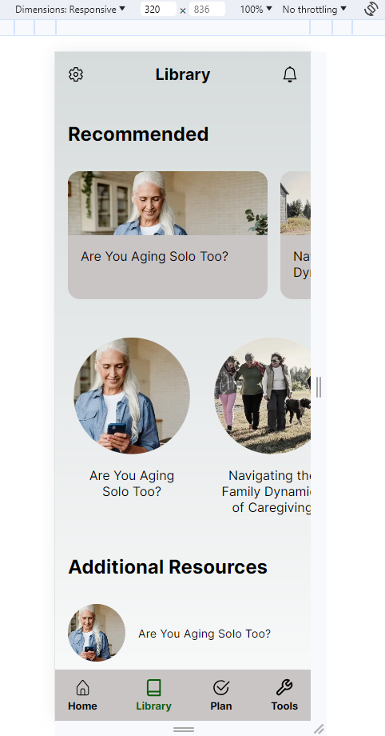

# Nextjs v14 demo project

## This is a full demo application to show the core functionalities of Nextjs v14

This project was built with **TypeScript** and **Nextjs v14**. It was design to run on _Mobile S - 320px_, and it include the following functionalities:

- LogIn with GitHub
- How to protect routes
- How to use of **server** components and **client** components
- How to use **React Contexts** for managing state (or dependency injection)
- How to create an **Api Layer** using the server actions
- Retrieve and render fetched data

## How to run and use this demo application:

1. Clone this project => git clone https://github.com/Martin0619/CaregiverDemoApp.git
2. Install dependencies => pnpm install (or npm install)
3. Create a secret key for NextAuth => openssl rand -base64 32
4. Create a GitHub OAuth app and generate a secret => https://github.com/settings/developers
5. Expose the following environment variables or create at the root level of the project a .env.local file with:
   1. NEXTAUTH_SECRET=
   2. GITHUB_ID=
   3. GITHUB_SECRET
6. Run the application in development mode => pnpm dev (or npm run dev)
